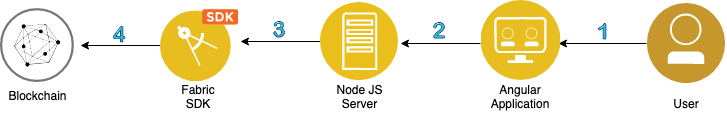

# Implement attribute based access control to provide end to end visibility into the supply chain history of a particular product 

This sample demonstrates an end to end blockchain application that connects to Hyperledger Fabric 1.4 or the IBM Blockchain Platform. It implements attribute based access control, user management,
event management, and a Angular front-end UI to interact and query the blockchain ledger. The 
sample takes the user through ordering, shipping, and enlisting the product for the customer to 
purchase. The customer can trace the order history through the supply chain, providing 
end to end visibility. Lastly, a regulator has access to all orders in the system to ensure 
correct practices are followed. 

When the reader has completed this code pattern, they will understand:

- Attribute Based Access Control
- User Management using [Hyperledger Fabric node.js SDK CA Client (FabricCAServices)](hyperledger.github.io/fabric-sdk-node/)
- How to customize queries
- External Event management using [PubNub](https://www.pubnub.com/)
- How to bring together a Hyperledger Fabric network, Fabric Client for user management and a front end UI (Angular)

**Audience level : Intermediate Developers**

### Permissioned blockchains - enabling transparancy and confidentiality

In supply chain, confidentiality is mandatory since some consumers might be given 
discounted rates compared to others. In this scenario, other consumers should not be able to access 
their competitors' rates. Given that Hyperledger Fabric is optimized for a broad range of 
industry use-cases, including supply chain, the open-source framework provides a way to implement 
confidentiality at the chaincode layer using attribute based access control. This example shows you 
how to implement such functionality, by registering each user with a specific attribute, called "usertype".
To jump to the code that does this, go [here](https://github.ibm.com/customer-success/Blockchain-GenSupplyChain/blob/master/application/server/utils.js#L221);
The usertype can be either an admin, a regulator, a producer, a shipper, a retailer, or a 
customer, and is generated when a specific user registers in the application. When that user logs in
successfully, and connects to an instance of the Hyperledger Fabric network, their "usertype" gives them access to certain transactions that have been submitted on the network. For example,
the regulator (such as the FDA) is able to view all transactions on the network in order to reliably audit
the network, but the retailer is only able to view the transactions which they are a part of. Once you
understand how to apply these access control rules, you can apply them to any use-case, and 
start building innovative, secure, blockchain networks. 

When the reader has completed this code pattern, they will understand how to:

1. Implement attribute based access control in Hyperledger Fabric
2. Build a chaincode in which certain users have access to certain transactions
3. Emit events triggered by blockchain transactions
4. Use a Angular UI to interact with a Hyperleder Fabric network.

## Application Access Control Rules, Architecture, and Model can be found [here](https://github.ibm.com/customer-success/Blockchain-GenSupplyChain/blob/master/app-architecture.md) 


## Architecture Diagram


## Flow Diagram



## Flow Description
1) The user interacts with an Angular Web UI to update and query the blockchain ledger and state
2) The UI calls Node.js application APIs running on a backend server
3) The Node.js application server calls Fabric SDK APIs https://fabric-sdk-node.github.io/release-1.4/index.html
4) The Fabric SDK interacts with and submits transactions to a deployed IBM Blockchain Platform 2.0 or a Hyperledger Fabric 1.4.1 network

The value of running this network on the IBM Blockchain Platform is that one can easily customize the network infrastructure as needed, whether that is the location of the nodes, the CPU and RAM of the hardware, the endorsement policy needed to reach consensus, or adding new organizations and members to the network.

# Included components
* [IBM Blockchain Platform Extension for VS Code](https://marketplace.visualstudio.com/items?itemName=IBMBlockchain.ibm-blockchain-platform) is designed to assist users in developing, testing, and deploying smart contracts -- including connecting to Hyperledger Fabric environments.
*	[IBM Blockchain Platform](https://console.bluemix.net/docs/services/blockchain/howto/ibp-v2-deploy-iks.html#ibp-v2-deploy-iks) gives you total control of your blockchain network with a user interface that can simplify and accelerate your journey to deploy and manage blockchain components on the IBM Cloud Kubernetes Service.
*	[IBM Cloud Kubernetes Service](https://www.ibm.com/cloud/container-service) creates a cluster of compute hosts and deploys highly available containers. A Kubernetes cluster lets you securely manage the resources that you need to quickly deploy, update, and scale applications.

## Featured technologies
+ [Hyperledger Fabric v1.4](https://hyperledger-fabric.readthedocs.io) is a platform for distributed ledger solutions, underpinned by a modular architecture that delivers high degrees of confidentiality, resiliency, flexibility, and scalability.
+ [Node.js](https://nodejs.org) is an open source, cross-platform JavaScript run-time environment that executes server-side JavaScript code.
+ [Angular](https://angular.io/) Angular is a platform for building mobile and desktop web applications.

## Prerequisites (Local)
If you want to run this pattern locally, without any Cloud services, then all you need is VSCode and the
IBM Blockchain Platform extension. 
- [Install VSCode version 1.38.0 or greater](https://code.visualstudio.com/download)
- [Install IBM Blockchain Platform Extension for VSCode](https://github.com/IBM-Blockchain/blockchain-vscode-extension)
- [Node v8.x or greater and npm v5.x or greater](https://nodejs.org/en/download/)

# IBM Cloud (IBM Blockchain Platform stes) shown [here](https://github.ibm.com/customer-success/Blockchain-GenSupplyChain#ibp-platform)

# Local installation steps: Hyperledger Fabric 1.4 Deployment using VSCode
1. [Clone the Repo](#step-1-clone-the-repo)
2. [Start the Fabric Runtime](#step-2-start-the-fabric-runtime)
3. [Import Install and Instantiate Contract](#step-3-import-install-and-instantiate-contract)
4. [Export Connection Details](#step-4-export-connection-details)
5. [Export Local Wallet](#step-5-export-connection-details)
6. [Build and Run the App](#step-6-build-and-run-the-app)
7. [Submit transactions in the app](#step-7-Submit-transactions-in-the-app)

## Step 1. Clone the Repo

Git clone this repo onto your computer in the destination of your choice:
```
git clone git@github.ibm.com:customer-success/Blockchain-GenSupplyChain.git
```
## Step 2. Start the Fabric Runtime


- If you get errors like the gRPC error, you may need to download an earlier version of VSCode (1.39) [here](https://code.visualstudio.com/updates/v1_39). Note that if you are using Mac, make sure the VSCode in your ~/Applications
folder shows version 1.39 when you click on show details. You may need to 
move newer version into the trash, and then empty the trash for the older 
version to work.

- First, we need to go to our IBM Blockchain Extension. Click on the IBM Blockchain icon
  in the left side of VSCode (It looks like a square). 
- Next, start your local fabric by clicking on 
  *1 Org Local Fabric* in the **FABRIC ENVIRONMENTS** pane.
  
- Once the runtime is finished starting (this might take a couple of minutes), under *Local Fabric* you should see *Smart Contracts* and a section for both *installed* and *instantiated*.

## Step 3. Import Install and Instantiate Contract

- Next, we have to import our contract before we can install it. Click on 
**View -> Open Command Pallette -> Import Smart Contract**. Next, click 
on the `gensupplychainnet@0.0.1.cds` file that is at the root of our directory.
This will be where you cloned this repo.


- Now, let's click on *+ Install* and choose the peer that is available. Then the extension will ask you which package to 
 install. Choose *gensupplychainnet@0.0.1.cds*.
- Lastly, we need to instantiate the contract to be able to submit transactions 
on our network. Click on *+ Instantiate* and then choose *gensupplychainnet@0.0.1*.
- When promted for a function, a private data collection, or and endorsement 
policy, hit `enter` on your keyboard, which will take all of the defaults.
- This will instantiate the smart contract. This may take some time. You should see the contract under the *instantiated* tab on the left-hand side, once it 
is finished instantiating.

## Step 4. Export Connection Details


- Connect to the "Local Fabric - Org1" gateway as `admin`.  Right click on the 3 dot menu on the **FABRIC GATEWAYS** pane and `Export Connection Profile` Save this file to <git_tree>/Blockchain-GenSupplychain/src/gateway/local/fabric_connection.json. 


## Step 5. Export Local Wallet

- 🚨Under the `FABRIC WALLETS` pane, click on `1 Org Local Fabric - Org1 Wallet`. Note this is very important, if you click on the Orderer wallet at the top, 
the application will not work! 🚨
- Export the and save the wallet as `gen_local_wallet` to 
<git_tree>/Blockchain-GenSupplychain/src/gateway/local/gen_local_wallet.json. 

## Step 6. Build and Run the app

- Next, we need to install the dependencies. Navigate to 
`Blockchain-GenSupplyChain/application/client/generic-ang` and run `npm install`.
- Next, let's install the server-side app. Navigate to 
`Blockchain-GenSupplyChain/application/server` and run 
`npm install`.


- Run `node server.js` to connect to the network. 
- Run `ng serve` to build the Angular app.
- Go to localhost:4200 to view the app.

## Step 7. Submit transactions in the app

### Test Scenario - automatic, using curl against API server
```
cd <git_tree>/Blockchain-GenSupplychain/scripts
./create_identities.sh
./testcase.sh
```
### Start the client side applications:

In a separate terminal window -

#### 1) build and install all dependencies:
```
cd <git_tree>/Blockchain-GenSupplychain/src/client/generic-ang
npm install
```
#### 2) Start the application
```
ng -o serve --port 4200
```
### Test Scenario - Manual, using UI

#### 1) Log in as Admin 

id: admin

password: adminpw

#### 2) Create users
Select the "Create New User" tab and enter the following users:
```
id: GHFarm
password: adminpw
role: producer

id: Walmart
password: adminpw
role: retailer

id: UPS
password: adminpw
role: shipper

id: ACustomer
password: adminpw
role: customer

id: FDA
password: adminpw
role: regulator
```
#### 3) Register each new User
Select the Register tab from the Login screen, enter the ID, password and role of each user.

#### 4) Start a portal for each user
For each other user open a separate terminal, start the application on a unique port
```
ng -o serve --port 420X
```
#### 4) On first application instance, login as "Walmart", this will enroll the "Walmart" participant and should take you to the Retailer Portal

Create a couple orders:
```
Product ID: corn
Price:        10
Quantity:     10
Producer ID:  GHFarm
```
Click "Create Order"
```  
Product ID: avocado
Price:      5
Quantity:   15
Producer ID:  GHFarm
```
Click "Create Order"

#### 6) On another application instances, log in as "GHFarm", this should take you to the Producer Portal

- click on the order
- select the "Accept Order" button for the corn product
- select the "Assign Shipper" button for the corn product
- enter a "UPS"

#### 6) On another appication instance, log in as "UPS", this should take you to the Shipper Portal

- click on the order
- select the "Create Shipment" button for the corn product and enter a tracking number
- select the "Transport Shipment" button for the corn product

#### 7) Back on the Retailer Portal

- click on the order
- select the "Receive Shipment" button for the corn product

#### 8) On Producer Portal submit a couple of Price/Quantity Change notifications.
**Note** if Quantity is left blank, this is considered a **Price Change Notification**, otherwise it is considered a **Quantity Change Notification**
```
Product ID:   mango
Price:        4
```
Click "Price/Quantity Change"

- This will generate a **Price Change Notification** and an order will automatically be created since we created a rule that says if mangos drop to $5 or below, order 10 crates.
```
Product ID:   tomato
Price:        2
Quantity:     25
```
Click "Price/Quantity Change"

- This will generate a **Quantity Change Notification** and an order will automatically be created since we created a rule that says if tomatos drop to $5 or below, and there are at least 20 crates available, order 20 crates.

The new orders should appear for designated participants

A Blockchain Event will be generated when an order is created this way.  

External message notifications are sent when order states are changed and Price/Quantity Change notifications are sent.

#### 9) On another appication instance, log in as "FDA", this should take you to the Regulator Portal

- This will bring up a list of all orders
- Clicking on an order will display all of the transaction history of that order

#### 10) On another appication instance, log in as "ACustomer", this should take you to the Customer Portal

- Enter order id for corn (representing a barcode of a particular product with is associated with that order)
- Order transaction history should be displayed

## IBM Blockchain Platform steps
This Cloud pattern assumes you have an IBM Cloud account.

- IBM Cloud account
- Node v8.x or greater and npm v5.x or greater

- Create a Kubernetes Cluster using the IBM Kubernetes Service
https://cloud.ibm.com/docs/containers?topic=containers-getting-started
- Create an IBM Blockchain service including all relevant components, such as Certificate Authority, MSP (Membership Service Providers), peers, orderers, and channels.
https://cloud.ibm.com/docs/services/blockchain?topic=blockchain-ibp-v2-deploy-iks
- Export the Connection Profile from the IBP instance and save as <git tree>/Blockchain_GenSupplyChain/src/gateway/ibp/fabric_connection.json. For instructions on how to do that on the IBM Blockchain Platform, go [here](https://cloud.ibm.com/docs/services/blockchain/howto?topic=blockchain-ibp-console-app#ibp-console-app-profile). NOTE: to export the IBP connection profile, the smart contract located [here](https://github.ibm.com/customer-success/Blockchain-GenSupplyChain/blob/master/gensupplychainnet%400.0.1.cds) must be installed.
<!-- 
#### Local Fabric
- In the VSCode IDE Blockchain extention  **FABRIC ENVIRONMENTS** pane, click on `Local Fabric` to start a fabric network.
- Connect to the "Local Fabric - Org1" gateway as `admin`.  Right click on the 3 dot menu on the **FABRIC GATEWAYS** pane and `Export Connection Profile` Save this file to <git_tree>/Blockchain-GenSupplychain/src/gateway/local/fabric_connection.json. 

### Start the server side of the application. 
NOTE: This will automatically enroll admin credentials in the directory of the wallet path specified in <git_tree>/Blockchain-GenericSupplychain/src/gateway/\<local or ibp\>/config.json

In a terminal window -
```
cd <git_tree>/Blockchain-GenSupplychain/src/server

export PORT=<PORT #>          // Defaults to 3000
export PLATFORM= <IBP|LOCAL>  // Defaults to LOCAL
node server.js
```
### Connect up wallet
- Create a Wallet in VSCode: select the "+" in the **FABRIC WALLETS** section. Choose "Specify an existing filesystem wallet".  Choose the directory of the wallet path specified in <git_tree>/Blockchain-GenericSupplychain/src/gateway/\<local or ibp\>/config.json.
- Create a gateway for this application: select the "+" in the **FABRIC GATEWAYS** pane. Choose the recently downloaded connection profile when prompted.
- Connect to your new Gateway, will be prompted to connect a wallet, choose the wallet path specified in <git_tree>/Blockchain-GenericSupplychain/src/gateway/\<local or ibp\>/config.json
- Ensure that the contract (.cds file) located in https://github.ibm.com/customer-success/Blockchain-GenSupplyChain has been installed and instantiated via the VSCode Blockchain IDE extension and
is running on a local fabric or the IBP V2 service. See https://marketplace.visualstudio.com/items?itemName=IBMBlockchain.ibm-blockchain-platform for information in installing the VSCode Blockchain IDE extension and tutorials on how to install a smart contract. -->


## Helpful links
https://cloud.ibm.com/docs/containers?topic=containers-getting-started

https://fabric-sdk-node.github.io/release-1.4/index.html

https://fabric-sdk-node.github.io/release-1.4/module-fabric-network.html

https://marketplace.visualstudio.com/items?itemName=IBMBlockchain.ibm-blockchain-platform

https://cloud.ibm.com/docs/services/blockchain/howto?topic=blockchain-ibp-console-build-network#ibp-console-build-network

## Contributers

Sowmya Janakiraman

Ann Umberhocker

Kaleen Iwema
