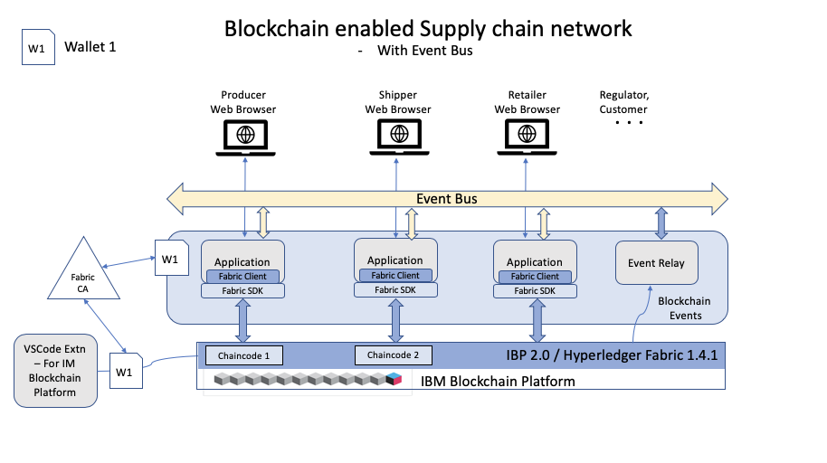

# Implement attribute based access control to provide end to end visibility into the supply chain history of a particular product 


This sample demonstrates an end to end blockchain application that connects to Hyperledger Fabric 1.4 or the IBM Blockchain Platform. It implements attribute based access control, user management, and a Angular front-end UI to interact and query the blockchain ledger. The 
sample takes the user through ordering, shipping, and enlisting the product for the customer to 
purchase. The customer can trace the order history through the supply chain, providing 
end to end visibility. For example, in the video above, you can see the retailer receiving a shipment, and then a customer logging into the application to see a trace of when the shipment was orderered, shipped, and received. Lastly, a regulator has access to all orders in the system to ensure 
correct practices are followed. 

**Audience level : Intermediate Developers**

### Permissioned blockchains - enabling transparancy and confidentiality

In supply chain, confidentiality is mandatory since some consumers might be given 
discounted rates compared to others. In this scenario, other consumers should not be able to access 
their competitors' rates. Given that Hyperledger Fabric is optimized for a broad range of 
industry use-cases, including supply chain, the open-source framework provides a way to implement 
confidentiality at the chaincode layer using attribute based access control. This example shows you 
how to implement such functionality, by registering and enrolling each user with a specific attribute, called "usertype".
To jump to the code that does this, go [here](https://github.com/IBM/fabric-contract-attribute-based-access-control/blob/master/application/server/utils.js#L220);
The "usertype" can be **admin**, **regulator**, **producer**, **shipper**, **retailer**, or **customer**. When that user logs in
successfully, and connects to an instance of the Hyperledger Fabric network, their "usertype" gives them access to certain transactions that have been submitted on the network. For example,
the **regulator** (such as the FDA) is able to view all transactions on the network in order to reliably audit
the network, but a **retailer** is only able to access assets and invoke transactions against assets which they are involved with. Once you
understand how to apply these access control rules, you can apply them to any use-case, and 
start building innovative, secure, blockchain networks. 

When the reader has completed this code pattern, they will understand how to:

1. Implement attribute based access control in Hyperledger Fabric
2. Build a chaincode in which certain users have access to certain transactions
3. Use an Angular UI to interact with a Hyperleder Fabric network.

## Application Access Control Rules, Architecture, and Model can be found [here](https://github.com/IBM/fabric-contract-attribute-based-access-control/blob/master/app-architecture.md) 

## Architecture Diagram


## Flow Diagram


## Flow Description
1) The user interacts with an Angular Web UI to update and query the blockchain ledger and state
2) The UI calls Node.js application APIs running on a backend server
3) The Node.js application server calls Fabric SDK APIs [see documentation here](https://hyperledger.github.io/fabric-sdk-node/release-1.4/index.html)
4) The Fabric SDK interacts with and submits transactions to a deployed IBM Blockchain Platform 2.0 or a Hyperledger Fabric 1.4.1 network

The value of running this network on the IBM Blockchain Platform is that one can easily customize the network infrastructure as needed, whether that is the location of the nodes, the CPU and RAM of the hardware, the endorsement policy needed to reach consensus, or adding new organizations and members to the network.

# Included components
* [IBM Blockchain Platform Extension for VS Code](https://marketplace.visualstudio.com/items?itemName=IBMBlockchain.ibm-blockchain-platform) is designed to assist users in developing, testing, and deploying smart contracts -- including connecting to Hyperledger Fabric environments.
*	[IBM Blockchain Platform](https://console.bluemix.net/docs/services/blockchain/howto/ibp-v2-deploy-iks.html#ibp-v2-deploy-iks) gives you total control of your blockchain network with a user interface that can simplify and accelerate your journey to deploy and manage blockchain components on the IBM Cloud Kubernetes Service.
*	[IBM Cloud Kubernetes Service](https://www.ibm.com/cloud/container-service) creates a cluster of compute hosts and deploys highly available containers. A Kubernetes cluster lets you securely manage the resources that you need to quickly deploy, update, and scale applications.

## Featured technologies
+ [Hyperledger Fabric v1.4](https://hyperledger-fabric.readthedocs.io) is a platform for distributed ledger solutions, underpinned by a modular architecture that delivers high degrees of confidentiality, resiliency, flexibility, and scalability.
+ [Node.js](https://nodejs.org) is an open source, cross-platform JavaScript run-time environment that executes server-side JavaScript code.
+ [Angular](https://angular.io/) Angular is a platform for building mobile and desktop web applications.

# Watch the Video - Network Setup (Local - VSCode Extension)

[](https://www.youtube.com/watch?v=7QWV40vZTM4)

# Watch the Video - App Demo (Local - Angular UI)

[](https://www.youtube.com/watch?v=EjJS_bRgoS8)


## Prerequisites (Local)
If you want to run this pattern locally, without any Cloud services, then all you need is VSCode and the
IBM Blockchain Platform extension. 
- [Install VSCode version 1.39](https://code.visualstudio.com/download)
- [Install IBM Blockchain Platform Extension for VSCode](https://github.com/IBM-Blockchain/blockchain-vscode-extension)
- [Node v8.x or greater and npm v5.x or greater](https://nodejs.org/en/download/)
# Steps (Cloud Deployment)
> To run a cloud network, you can find steps [here](https://github.com/IBM/fabric-contract-role-based-access-control/blob/master/README.md#ibm-blockchain-platform-steps).

# Steps (Hyperledger Fabric Local Deployment)
1. [Clone the Repo](#step-1-clone-the-repo)
2. [Start the Fabric Runtime](#step-2-start-the-fabric-runtime)
3. [Install and Instantiate Contract](#step-3-install-and-instantiate-contract)
4. [Export Connection Details](#step-4-export-connection-details)
5. [Export Local Wallet](#step-5-export-local-wallet)
6. [Build and Run the App](#step-6-build-and-run-the-app)
7. [Submit transactions in the app](#step-7-submit-transactions-in-the-app)

## Step 1. Clone the Repo

Clone this repo onto your computer in the destination of your choice:
```
git clone https://github.com/IBM/fabric-contract-attribute-based-access-control.git
```
## Step 2. Start the Fabric Runtime


- If you get errors like the gRPC error, you may need to download an earlier version of VSCode (1.39) [here](https://code.visualstudio.com/updates/v1_39). Note that if you are using Mac, make sure the VSCode in your /Applications
folder shows version 1.39 when you click on show details. You may need to 
move newer version into the trash, and then empty the trash for the older 
version to work.

- First, we need to go to our IBM Blockchain Extension. Click on the IBM Blockchain icon
  in the left side of VSCode (It looks like a square). 
- Next, start your local fabric by clicking on 
  *1 Org Local Fabric* in the **FABRIC ENVIRONMENTS** pane.
  
- Once the runtime is finished starting (this might take a couple of minutes), under *Local Fabric* you should see *Smart Contracts* and a section for both *installed* and *instantiated*.

## Step 3. Install and Instantiate Contract

- Next, we have to import our contract before we can install it. Click on 
**View -> Open Command Pallette -> Import Smart Contract**. Next, click 
on the `gensupplychainnet@0.0.1.cds` file that is at the root of our directory.
This will be where you cloned this repo.


- Now, let's click on *+ Install* and choose the peer that is available. Then the extension will ask you which package to 
 install. Choose *gensupplychainnet@0.0.1.cds*.
- Lastly, we need to instantiate the contract to be able to submit transactions 
on our network. Click on *+ Instantiate* and then choose *gensupplychainnet@0.0.1*.
- When promted for a function, a private data collection, or and endorsement 
policy, hit `enter` on your keyboard, which will take all of the defaults.
- This will instantiate the smart contract. This may take some time. You should see the contract under the *instantiated* tab on the left-hand side, once it 
is finished instantiating.

## Step 4. Export Connection Details
- Under `FABRIC GATEWAYS`, click on `1 Org Local Fabric - Org1` gateway.
- When asked to choose an identity to connect with, choose `admin`.
- Once you are connected, you should see `connected via gateway: 1 Org Local Fabric` 
under the `FABRIC GATEWAYS` tab as shown in the gif below.


- To export your connection profile, right click on the 3 dot menu on the **FABRIC GATEWAYS** pane and `Export Connection Profile` Save this file to fabric-contract-attribute-based-access-control/gateway/local/fabric_connection.json. 

## Step 5. Export Local Wallet

- 🚨Under the `FABRIC WALLETS` pane, click on `1 Org Local Fabric - Org1 Wallet`. Note this is very important, if you click on the Orderer wallet at the top, 
the application will not work! 🚨
- Export and save the wallet to `fabric-contract-attribute-based-access-control/gateway/local/gen_local_wallet`
- Once you're done exporting the wallet and the connection profile, your directory 
structure should look like below:


## Step 6. Build and Run the app

- Next, let's install the server-side app. Navigate to 
`fabric-contract-attribute-based-access-control/application/server` and run 
`npm install`.
- Next, we need to install the UI dependencies. Navigate to 
`fabric-contract-attribute-based-access-control/application/client` and run `npm install`.


- Navigate to 
`fabric-contract-attribute-based-access-control/application/server` and run `node server.js` to connect start the API server to the fabric network. 
- Navigate to 
`fabric-contract-attribute-based-access-control/application/client` and run `ng serve` to run the Angular app.
- Go to localhost:4200 to view the app.

## Step 7. Submit transactions in the app

### Test Scenario - automatic, using curl against API server
```
cd fabric-contract-attribute-based-access-control/scripts
./create_identities.sh
./testcase.sh
```
### Test Scenario - Manual, using client side UI
- Navigate to http://localhost:4200

#### 1) Log in as admin 

id: admin

password: adminpw

#### 2) Create users


Select the "Register New User" tab and enter the following users:
```
id: GHFarm
password: GHFarm
role: producer

id: Walmart
password: Walmart
role: retailer

id: UPS
password: UPS
role: shipper

id: ACustomer
password: ACustomer
role: customer

id: FDA
password: FDA
role: regulator
```
#### 3) Enroll each new User

Select the Enroll tab from the Login screen, enter the ID, password and type of each user. Note that the video above only shows enrollment for GHFarm and Walmart, but you
should repeat the process for the FDA, ACustomer, and UPS as well.

#### 4) Log in as "Walmart"


On the "Log in" page, log in as Walmart. This should take you to the Retailer Portal as *Walmart*

Create a couple orders:
```
Product ID: corn
Price:        10
Quantity:     10
Producer ID:  GHFarm
```
Click "Create Order"
```  
Product ID: avocado
Price:      5
Quantity:   15
Producer ID:  GHFarm
```
Click "Create Order"

#### 5) Log out and in as "GHFarm"


Click the person icon in top right of window to logout to be redirected to the login screen. Log in as GHFarm. This should take you to the Producer Portal as *GHFarm*

- click on the corn order
- select the "Accept Order" button for the corn product
- select the "Assign Shipper" button for the corn product
- enter a "UPS"

#### 6) Log out and in as "UPS"


This should take you to the Shipper Portal as *UPS*

- click on corn order
- select the "Create Shipment" button for the corn product
- select the "Transport Shipment" button for the corn product

#### 7) Log out and in as "Walmart" again


- click on corn order
- select the "Receive Shipment" button for the corn product

#### 8) Log out and in as "FDA"


This should take you to the  Regulator Portal as *FDA*

- This will bring up a list of all orders
- Clicking on an order will display all of the transaction history of that order

#### 9) Log out and in as "ACustomer"


This should take you to the Customer Portal as *ACustomer*

- Enter order id for corn (representing a barcode of a particular product with is associated with that order)
- Order transaction history should be displayed
- Enter order id for avocado.  An error should appear indicating that the customer can't see this order. It hasn't made it through the process yet.  

## IBM Blockchain Platform steps

### Prereqs:
- IBM Cloud account
- Node v8.x or greater and npm v5.x or greater

### Steps:
- Create a Kubernetes Cluster using the IBM Kubernetes Service
https://cloud.ibm.com/docs/containers?topic=containers-getting-started
- Create an IBM Blockchain service including all relevant components, such as Certificate Authority, MSP (Membership Service Providers), peers, orderers, and channels.
https://cloud.ibm.com/docs/services/blockchain?topic=blockchain-ibp-v2-deploy-iks
- Export the Connection Profile from the IBP instance and save as Blockchain_GenSupplyChain/gateway/ibp/fabric_connection.json. For instructions on how to do that on the IBM Blockchain Platform, go [here](https://cloud.ibm.com/docs/services/blockchain/howto?topic=blockchain-ibp-console-app#ibp-console-app-profile). NOTE: to export the IBP connection profile, the smart contract located [here](https://github.com/IBM/fabric-contract-attribute-based-access-control/blob/master/gensupplychainnet%400.0.1.cds) must be installed.

For instructions on how to deploy the API server and UI client to the cloud, go [here](https://github.com/IBM/fabric-contract-attribute-based-access-control/tree/master/kube-config)

## Helpful links
https://cloud.ibm.com/docs/containers?topic=containers-getting-started

https://hyperledger.github.io/fabric-sdk-node/release-1.4/

https://hyperledger.github.io/fabric-sdk-node/release-1.4/module-fabric-network.html

https://marketplace.visualstudio.com/items?itemName=IBMBlockchain.ibm-blockchain-platform

https://cloud.ibm.com/docs/services/blockchain/howto?topic=blockchain-ibp-console-build-network#ibp-console-build-network

## Contributers

Sowmya Janakiraman

Ann Umberhocker

Kaleen Iwema


## License
This code pattern is licensed under the Apache Software License, Version 2.  Separate third party code objects invoked within this code pattern are licensed by their respective providers pursuant to their own separate licenses. Contributions are subject to the [Developer Certificate of Origin, Version 1.1 (DCO)](https://developercertificate.org/) and the [Apache Software License, Version 2](http://www.apache.org/licenses/LICENSE-2.0.txt).

[Apache Software License (ASL) FAQ](http://www.apache.org/foundation/license-faq.html#WhatDoesItMEAN)
