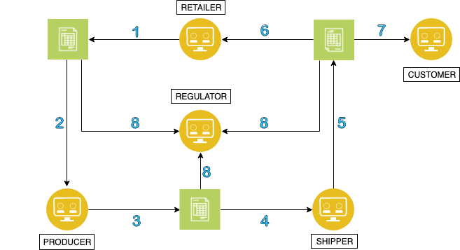
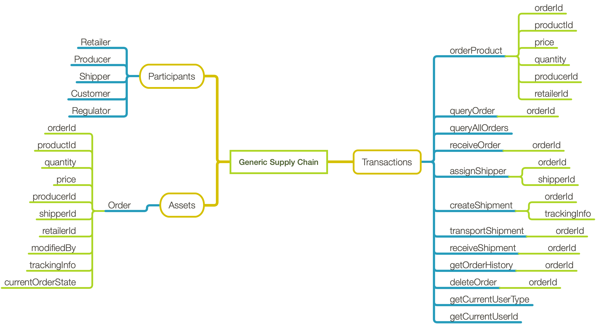

This project showcases the use of blockchain in the supply chain domain. In this application, we have five participants: a **Producer**, **Shipper**, **Retailer**, **Regulator**, and **Customer**. The scenario is such that: 

1) **Retailer** orders a product from a particular **Producer**.  
2) **Producer** accepts the **Order**
3) **Producer** fulfills **Order** by assigning it to a **Shipper**.
4) **Shipper** creates the shipment by adding a tracking number to the **Order**
5) **Shipper** transports the shipment back to the **Retailer**.
6) **Retailer** then accepts the shipment. The Product is now available for a **Customer** to purchase.
7) At this point the **Customer** can trace the **Order** history through the supply chain. This is essentially equivalant to scanning a UPC of a product and tracing it back to a farm.
8) At any point, the **Regulator** has access to all orders in the system to ensure the process is being followed for each product.

## Business Network Definition

### Assets

**Order** contains fields:

   - String *orderId*
   - String *productId*
   - Float *price*
   - Integer *quantity*
   - String *producerId*
   - String *shipperId*
   - String *retailerId*
   - String *modifiedBy*   
   - String *trackingInfo*
   - Enumerated *currentOrderState*
     - ORDER_CREATED: 1
     - ORDER_RECEIVED: 2
     - SHIPMENT_ASSIGNED: 3
     - SHIPMENT_CREATED: 4
     - SHIPMENT_IN_TRANSIT: 5
     - SHIPMENT_RECEIVED: 6
     - ORDER_CLOSED: 7

### Participants

**Retailer** -

  - Places an **Order** to a **Producer** 
  - Receives **Order** from a **Shipper**.

**Producer** -

   - Fulfills an **Order**
   - Assigns to a **Shipper**.

**Shipper** -

  - Creates shipment and transports **Order** assigned by **Producer**.

**Customer** -

  - Queries an **Order** to get the Order Transaction History, essentially tracing it back to origination.

**Regulator** -

  - Moderates all **Orders** in the system to ensure that proper quality and guidelines are being followed.

### Transactions

**1. orderProduct** - Creates an **Order** asset. *currentOrderState* is changed to ORDER_CREATED.

#### Inputs:

  - *orderId*
  - *productId*
  - *price*
  - *quantity*
  - *producerId*
  - *retailerId*

 #### Access Control:

  - Only a **Retailer** or a **Producer** can invoke this transaction

**2. receiveOrder** - Modifies an **Order** asset. *currentOrderState* is changed to ORDER_RECEIVED.

#### Input:

  - valid *orderId*

#### Access Control:

 - Only a **Retailer** can invoke this transaction

**3. assignShipper** - Modifies an **Order** asset. *currentOrderState* is changed to SHIPMENT_ASSIGNED.

#### Inputs:

  - valid *orderId*
  - valid *shipperId*

#### Access Control:

 - Only a **Retailer** can invoke this transaction

**4. createShipment** - Modifies an **Order** asset. *currentOrderState* is changed to SHIPMENT_CREATED.

#### Inputs:

  - valid *orderId*
  - trackingInfo

#### Access Control:

 - Only a **Shipper** can invoke this transaction

**5. transportShipment** - Modifies an **Order** asset. *currentOrderState* is changed to SHIPMENT_IN_TRANSIT.

#### Input:

  - valid *orderId*

#### Access Control:

 - Only a **Shipper** can invoke this transaction

**6. receiveShipment** - Modifies an **Order** asset. *currentOrderState* is changed to SHIPMENT_RECEIVED.

#### Input:

  - valid *orderId*

#### Access Control:

 - Only a **Retailer** can invoke this transaction

**7. deleteOrder** - Deletes an **Order** asset.

#### Input:

  - valid *orderId*

#### Access Control:

 - Only the originator of the **Order** can invoke this transaction

**8. queryOrder** - Query an **Order** asset.

#### Input:

  - valid *orderId*

#### Ouput:

  - returns a buffer containing the **Order** details

#### Access Control:

 - Only a **Producer**, **Shipper** or **Retailer** associated with the input *orderId* can invoke this transaction

**9. queryAllOrders** - Query all **Order** assets.

#### Output:

 - returns an array of **order** assets accessible by current active identity with details in JSON format.

#### Access Control:

 - Only **Orders** associated with the current user will be returned

**10. getOrderHistory** - Query transaction history of an **Order** asset.

#### Input:

  - valid *orderId*

#### Output:

- returns an array of JSON objects with the transaction history of an **Order**

#### Access Control:

 - If the current user is a **Customer**, the *currentOrderState* must equal ORDER_RECEIVED to invoke this transaction
 - Only a **Producer**, **Shipper** or **Retailer** associated with the input *orderId* can invoke this transaction
 - A **Regulator** can see the history of any **Order**

**11. getCurrentUserId** - Get the id of the current logged in user.

#### Output:

- a String containing the current user's id

**12. getCurrentUserType** - Get the type of the current logged in user.

#### Output:

- a String containing the current user's type

## Filesystem Organization
- server:

  + server.js - Uses Node Express to define the API routes
  + utils.js - Contains the Node JS support code to interact with the fabric network

- gateway:

   + ibp/config.json - Contains information used to run against a running IBM Blockchain 2.0 Service
   + local/config.json - Contains information used to run against a local Hyperledger v1.4 Fabric.

- client/*:

   Angular Frontend User Interface application

- contract/*:

  + The smart contract files.  VSCode needs to be opened up to this directory to package the smart contract. See https://marketplace.visualstudio.com/items?itemName=IBMBlockchain.ibm-blockchain-platform for more information on running VSCode IDE.

- kube-config/*:

   + files needed to deploy this sample onto an iks cluster
